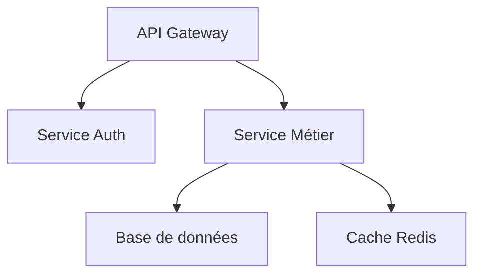
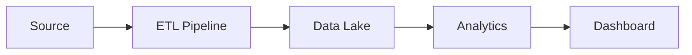

# Guide d'utilisation des illustrations et diagrammes

Ce guide explique comment le système génère automatiquement des illustrations et comment personnaliser les visuels dans vos propositions.

## Types d'illustrations disponibles

### 1. Diagrammes générés automatiquement

Le système génère automatiquement des diagrammes pour visualiser :

#### Diagramme de flux (flow)
- **Usage** : Processus linéaires, méthodologies étape par étape
- **Exemple** : Cadrage → Conception → Pilote → Déploiement

```json
{
  "type": "diagram",
  "title": "Notre méthodologie",
  "diagram_type": "flow",
  "elements": ["Cadrage", "Conception", "Pilote", "Déploiement"],
  "description": "Approche itérative en 4 phases"
}
```

#### Diagramme cyclique (cycle)
- **Usage** : Processus itératifs, cycles d'amélioration continue
- **Exemple** : Facteurs clés de succès interdépendants

```json
{
  "type": "diagram",
  "title": "Facteurs clés de succès",
  "diagram_type": "cycle",
  "elements": [
    "Implication parties prenantes",
    "Iterations courtes",
    "Alignement métier",
    "Transfert compétences"
  ],
  "description": "Cycle d'amélioration continue"
}
```

#### Diagramme pyramidal (pyramid)
- **Usage** : Hiérarchies, niveaux de priorité, structures organisationnelles
- **Exemple** : Pyramide des priorités

```json
{
  "type": "diagram",
  "title": "Hiérarchie des priorités",
  "diagram_type": "pyramid",
  "elements": [
    "Vision stratégique",
    "Objectifs métier",
    "Quick wins et actions",
    "Fondations techniques"
  ],
  "description": "Du stratégique à l'opérationnel"
}
```

#### Timeline horizontale (timeline)
- **Usage** : Chronologies, jalons projet, roadmaps
- **Exemple** : Planning de déploiement

```json
{
  "type": "diagram",
  "title": "Roadmap de déploiement",
  "diagram_type": "timeline",
  "elements": [
    "T0: Cadrage",
    "T+1M: POC",
    "T+3M: Pilote",
    "T+6M: Déploiement",
    "T+9M: Industrialisation"
  ],
  "description": "Jalons clés du projet sur 9 mois"
}
```

#### Matrice (matrix)
- **Usage** : Catégorisation 2x2 ou 2x3, quadrants de décision, comparaison
- **Exemple** : Matrice importance/urgence

```json
{
  "type": "diagram",
  "title": "Priorisation des actions",
  "diagram_type": "matrix",
  "elements": [
    "Important & Urgent",
    "Important & Moins urgent",
    "Moins important & Urgent",
    "Moins important & Moins urgent"
  ],
  "description": "Matrice de priorisation Eisenhower"
}
```

### 2. Images personnalisées

Pour ajouter vos propres images/schémas :

```json
{
  "type": "image",
  "title": "Architecture de la solution",
  "image_path": "/chemin/vers/votre/image.png",
  "caption": "Architecture cloud-native avec microservices",
  "bullets": [
    "Scalabilité horizontale",
    "Haute disponibilité",
    "Sécurité renforcée"
  ]
}
```

## Où placer des illustrations ?

Le système suggère automatiquement des illustrations pour :

### 1. Section "Démarche"
- **Diagramme flow** : Pour montrer les phases du projet
- Visualise le processus étape par étape
- Rend la méthodologie plus compréhensible

### 2. Section "Architecture/Solution"
- **Image ou diagramme** : Pour l'architecture technique
- Schémas d'infrastructure
- Diagrammes de composants

### 3. Section "Facteurs clés de succès"
- **Diagramme cycle** : Pour montrer l'interdépendance
- Met en évidence les éléments récurrents
- Visualise la dynamique du projet

### 4. Section "Références"
- **Images** : Captures d'écran de projets similaires
- Tableaux de bord
- Résultats visuels

## Bonnes pratiques

### Simplicité
- Maximum 4-6 éléments par diagramme
- Texte court et lisible
- Éviter la surcharge visuelle

### Cohérence
- Utiliser la palette Wenvision (terracotta, rose poudré, anthracite)
- Style uniforme à travers la présentation
- Typographie cohérente (Chakra Petch pour titres, Inter pour corps)

### Pertinence
- N'ajoutez des visuels que s'ils apportent de la valeur
- Privilégiez la clarté à la décoration
- Chaque visuel doit servir un objectif

## Génération automatique

Le système analyse automatiquement le contenu et génère des diagrammes quand c'est pertinent :

```python
# La génération est automatique dans generate_slides_structure()
slides = agent.generate_slides_structure(
    tender_analysis,
    references,
    template,
    adapted_cvs
)

# Le système ajoute automatiquement 1-3 diagrammes par proposition
# Types utilisés : flow, cycle, pyramid, timeline, matrix
```

## Génération de diagrammes via Claude + Mermaid

**NOUVEAU** : Le système utilise désormais **Claude pour générer des diagrammes d'architecture et d'infrastructure** via Mermaid, sans nécessiter DALL-E !

### Avantages
- ✅ **Gratuit** : Pas besoin de clé API OpenAI
- ✅ **Précis** : Diagrammes structurés et techniques
- ✅ **Rapide** : Génération en quelques secondes
- ✅ **Personnalisable** : Claude adapte le diagramme au contexte

### Prérequis : Installation de Mermaid CLI

Pour convertir les diagrammes Mermaid en images PNG, vous devez installer **mermaid-cli** :

```bash
# Prérequis : Node.js 18+ et npm
# Vérifier Node.js
node --version

# Installer mermaid-cli globalement
npm install -g @mermaid-js/mermaid-cli

# Vérifier l'installation
mmdc --version
```

**Note** : Si `mmdc` n'est pas installé, le système utilisera les diagrammes PowerPoint natifs (sans images externes). Les diagrammes seront quand même affichés, mais sous forme de formes PowerPoint plutôt que d'images Mermaid.

### Utilisation automatique

Activer la génération de diagrammes dans `.env` :

```bash
# Activer la génération de diagrammes Claude + Mermaid
USE_DALLE_IMAGES=true  # Malgré le nom, active aussi les diagrammes Mermaid
```

Le système génère automatiquement des diagrammes pour :
- **Architectures techniques** → Diagrammes de composants avec flux de données
- **Infrastructures** → Schémas d'infrastructure cloud/on-premise
- **Flux et processus** → Flowcharts détaillés

### Exemples de diagrammes générés

**Architecture microservices** :


**Flux de données** :


## Configuration DALL-E (optionnel, pour illustrations)

DALL-E est maintenant **optionnel** et utilisé uniquement en fallback si Mermaid échoue.

Pour activer DALL-E 3 :

```bash
# Clé API OpenAI pour DALL-E (optionnel)
OPENAI_API_KEY=sk-...votre-cle-api...

# Activer la génération d'images
USE_DALLE_IMAGES=true
```

### 2. Utilisation automatique

Une fois configuré, le système génère automatiquement des images pour :
- Les slides d'architecture technique
- Les schémas d'infrastructure
- Les visualisations complexes

```python
# Automatique si USE_DALLE_IMAGES=true et OPENAI_API_KEY configurée
proposal = agent.generate_proposal(
    tender_path="data/appel_offre.txt",
    output_path="output/proposal.json"
)
# Le PPTX contient des images DALL-E générées automatiquement
```

### 3. Génération manuelle de diagrammes

**Méthode 1 : Claude + Mermaid (recommandé)**

```python
from utils.image_generator import DiagramGenerator

generator = DiagramGenerator()

# Diagramme d'architecture
image_path = generator.generate_architecture_diagram(
    components=["API Gateway", "Auth Service", "Microservices", "PostgreSQL", "Redis Cache"],
    context={"client_name": "Client", "project_title": "Projet"},
    description="Architecture microservices cloud-native"
)

# Diagramme de flux
image_path = generator.generate_flow_diagram(
    steps=["Collecte", "Transformation", "Stockage", "Analyse", "Visualisation"],
    context={"client_name": "Client", "project_title": "Projet"},
    description="Pipeline de traitement de données"
)

# Diagramme de séquence
image_path = generator.generate_sequence_diagram(
    actors=["Client", "API Gateway", "Service Auth", "Database"],
    context={"client_name": "Client", "project_title": "Projet"},
    description="Flux d'authentification utilisateur"
)
```

**Méthode 2 : DALL-E (optionnel, nécessite OPENAI_API_KEY)**

Pour générer des images via DALL-E :

```python
from utils.image_generator import ImageGenerator

generator = ImageGenerator()

# Diagramme d'architecture
image_path = generator.generate_architecture_diagram(
    components=["API Gateway", "Microservices", "Base de données"],
    context={"client_name": "Client", "project_title": "Projet"}
)

# Flowchart de processus
image_path = generator.generate_process_flowchart(
    steps=["Cadrage", "Conception", "Pilote", "Déploiement"],
    context={"client_name": "Client", "project_title": "Projet"}
)

# Visualisation de données
image_path = generator.generate_data_visualization(
    viz_type="dashboard",  # ou 'chart', 'graph'
    context={"client_name": "Client", "project_title": "Projet"}
)
```

## Bibliothèque d'images réutilisables

Le système inclut une bibliothèque d'images pour stocker et réutiliser des visuels :

### Catégories prédéfinies
- `architecture` : Diagrammes d'architecture
- `process` : Flowcharts et processus
- `dashboard` : Tableaux de bord
- `team` : Photos d'équipe
- `technology` : Logos et icônes tech
- `data` : Visualisations de données
- `success` : Images de réussite/résultats
- `methodology` : Schémas méthodologiques
- `infrastructure` : Schémas d'infrastructure
- `mockup` : Mockups d'interfaces

### Ajouter une image à la bibliothèque

```python
from utils.image_generator import ImageLibrary

library = ImageLibrary()

# Ajouter une image
library.add_image(
    image_path="/chemin/vers/image.png",
    category="architecture",
    tags=["cloud", "microservices", "kubernetes"],
    description="Architecture microservices sur Kubernetes"
)
```

### Rechercher dans la bibliothèque

```python
# Par catégorie
images = library.search_images(category="architecture")

# Par tags
images = library.search_images(tags=["cloud", "kubernetes"])

# Par mot-clé
images = library.search_images(keyword="microservices")

# Récupérer une image aléatoire d'une catégorie
image_path = library.get_image_by_category("architecture")

# Statistiques
stats = library.get_statistics()
# {'total_images': 25, 'categories': 10, 'by_category': {...}}
```

## Personnalisation avancée

### Ajouter des images externes

1. **Placer vos images** dans `/wenvision-agents/data/images/`
2. **Référencer dans la génération** :

```python
# Dans votre code personnalisé
slides.insert(position, {
    "type": "image",
    "title": "Architecture cible",
    "image_path": "data/images/architecture.png",
    "caption": "Architecture microservices proposée",
    "bullets": [
        "API Gateway",
        "Services métier",
        "Base de données distribuée"
    ]
})
```

### Générer des images via API (avancé)

Pour générer des images automatiquement via DALL-E ou Midjourney :

```python
def generate_diagram_image(description: str) -> str:
    """
    Génère une image de diagramme via API

    Args:
        description: Description du diagramme à générer

    Returns:
        Chemin vers l'image générée
    """
    # Exemple avec DALL-E (nécessite clé API OpenAI)
    # from openai import OpenAI
    # client = OpenAI(api_key=os.getenv("OPENAI_API_KEY"))
    #
    # response = client.images.generate(
    #     model="dall-e-3",
    #     prompt=f"Professional business diagram: {description}",
    #     size="1024x1024",
    #     quality="standard",
    #     n=1,
    # )
    #
    # # Télécharger et sauvegarder l'image
    # image_url = response.data[0].url
    # # ... code pour télécharger et sauvegarder

    pass
```

## Exemples complets

### Proposition avec diagrammes automatiques

```python
from agents.proposal_generator import ProposalGeneratorAgent

agent = ProposalGeneratorAgent()
proposal = agent.generate_proposal(
    tender_path="data/appel_offre.txt",
    output_path="output/proposal.json"
)

# Le PPTX généré contient automatiquement :
# - Diagramme de méthodologie (flow)
# - Diagramme des facteurs de succès (cycle)
# - Tableaux de planning et budget
```

### Proposition avec images personnalisées

```python
# Après génération, ajouter des images
slides_structure = proposal['slides_structure']

# Insérer une image après la section "Solution"
slides_structure.insert(position_solution + 1, {
    "type": "image",
    "title": "Tableau de bord proposé",
    "image_path": "data/images/dashboard_mockup.png",
    "caption": "Interface utilisateur du tableau de bord",
    "bullets": [
        "Vue d'ensemble en temps réel",
        "Indicateurs clés personnalisables",
        "Alertes automatiques"
    ]
})

# Régénérer le PPTX avec les images
from utils.pptx_generator import build_proposal_pptx
build_proposal_pptx(
    template_path="WENVISION_Template_Palette 2026.pptx",
    slides_data=slides_structure,
    output_path="output/proposal_final.pptx",
    consultant_info=agent.consultant_info
)
```

## Formats d'images supportés

- **PNG** : Recommandé pour les diagrammes et captures d'écran
- **JPG** : Pour les photos
- **SVG** : Non supporté directement (convertir en PNG)

## Résolution recommandée

- **Largeur** : 1920px minimum
- **Hauteur** : 1080px minimum
- **Ratio** : 16:9 ou 4:3
- **DPI** : 150 minimum pour impression

## Support et limitations

### Ce qui fonctionne
- ✅ Diagrammes de flux (flow)
- ✅ Diagrammes cycliques (cycle)
- ✅ Diagrammes pyramidaux (pyramid)
- ✅ Timelines horizontales (timeline)
- ✅ Matrices 2x2 et 2x3 (matrix)
- ✅ Images PNG/JPG externes
- ✅ Génération automatique de 1-3 diagrammes par proposition
- ✅ Génération d'images via DALL-E 3 (optionnel, avec OPENAI_API_KEY)
- ✅ Bibliothèque d'images réutilisables avec catalogue

### Limitations actuelles
- ❌ Diagrammes complexes (UML, ERD détaillés) - utiliser des images externes
- ❌ Animations - PowerPoint statique uniquement
- ❌ Édition interactive des diagrammes dans l'interface web

### Développements futurs
- 🔄 Édition interactive des diagrammes
- 🔄 Animations PowerPoint
- 🔄 Support de diagrammes UML et ERD avancés
